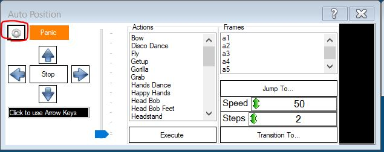
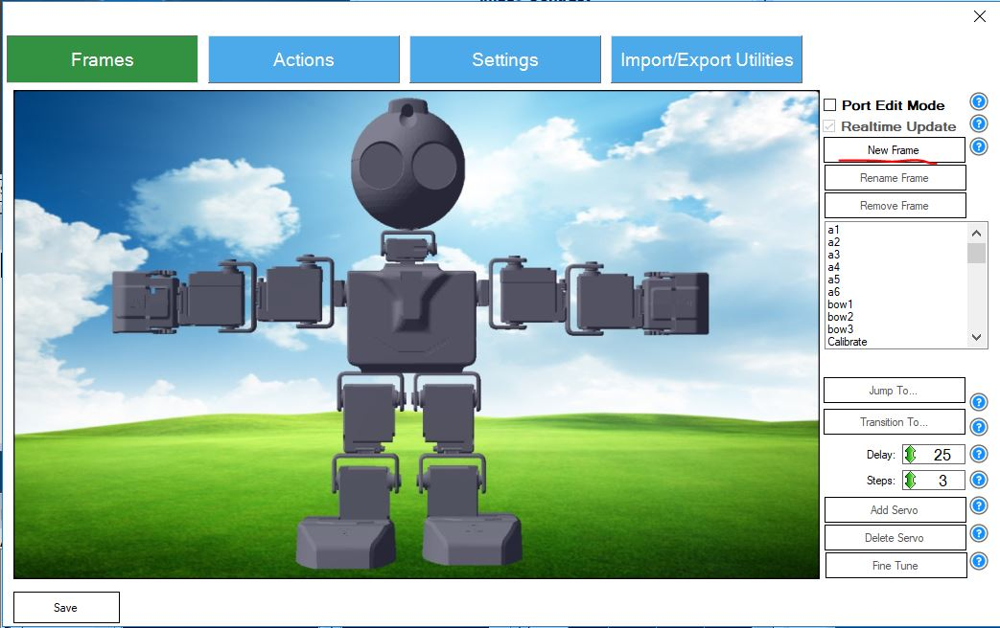
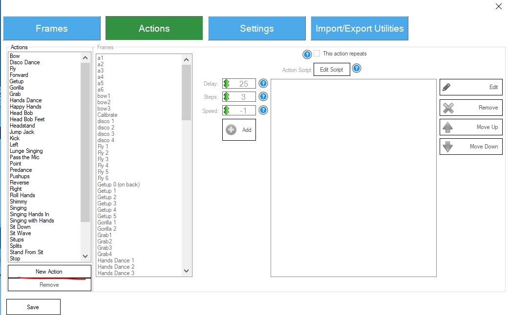
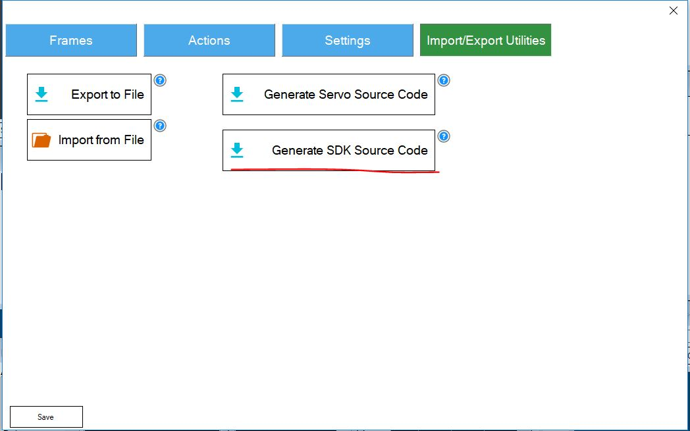

# EZ Robot JD Humanoid with Microsoft Cognitive Services

This project was created with aim to demonstrated several **[Microsoft Cognitive Services](https://azure.microsoft.com/en-us/services/cognitive-services/?)**, which provide possibility to easily utilize **Artificial Intelligence** thru REST API calls, without need of building complex machine learning algorithms and training data sets. Cognitive Services offers you also client libraries, for various programming languages, which makes their usage even easier. We have decided to incorporate these services to application built for controlling [EZ Robot JD Humanoid](https://www.ez-robot.com/Shop/AccessoriesDetails.aspx?productNumber=31) (further in document only EZ Robot). We have chosen this particular humanoid robot, as it is relatively easy to  assemble and provides .NET, UWP SDK or even Mono SDK which provide wider space for custom implementation. It also provides [EZ Builder application](https://www.ez-robot.com/Tutorials/Help.aspx?id=207), which enables to control EZ Robots and implement certain scenarios thru pre build functionality plugins or thru blockly blocks. This application is designed mainly for educational purposes, but it also provides "movement creator" feature which enables definition and also export of robot movements which can be further utilized in application built on top of SDK. This application is definitely great starting point for configuring and getting started with any type of EZ Robot.    

Application is based on existing [Windows Form project](https://github.com/ppedro74/ezrobot-playground/tree/master/sdk-applications/EZFormApplication), which utilizes EZ Robot's native capabilities and effectively implements work with camera and other native capabilities of EZ Robot. We have took this application and extended it and connected  to following Cognitive Services: Face API, Emotion API,  Speech API, Voice Recognition API, Language Understanding Intelligent Service, Speaker Recognition API, Computer Vision API, Custom Vision API.  Thanks to these services robot obtained following capabilities:

- **Voice commands recognition** - besides command buttons in Win Form application which invoke certain robot's  actions we added Speech Recognition and Natural Language Understanding capabilities, so EZ Robot understands to spoken commands.
- **Face recognition and identification** - EZ Robot is able to detect faces together with several face attributes and also to identify person by the face
- **Emotion recognition** - when recognizing faces, EZ Robot includes also emotion recognition
- **Speaker recognition** -EZ Robot is able to recognize people based on their voice
- **Computer vision** - EZ Robot is able to provide description of environment it sees
- **Custom object recognition** - EZ Robot is able to recognize specific objects, if they are placed in its vision field

You can find video demonstration of robot's cognitive abilities in this video.

[](https://youtu.be/vf89wZiuzzE)


## Working with EZ Robot SDK

Further in this document we shortly discuss how we utilize JD Robots SDK and also scenarios implemented using Cognitive Services in deeper detail.

### Connecting to EZ Robot

Main prerequisite for implementation of application was that we are able to connect to robot from our application code and invoke movement and receive image input from camera. Application itself is being executed on computer, as EZ Robot does not have it's own runtime and storage, where the application would be placed and ran. That means, that application runs on dev machine which connects to EZ Robot and it's camera thru wifi network either directly to access point started by robot itself (AP Mode), or thru wifi network created by router (client mode) . We have used second option as it allows you to connect to internet while developing and running application.  More on how to setup networking on EZ Robot can be found here: https://www.ez-robot.com/Tutorials/UserTutorials/92/1 . Once you connect your EZ Robot to wifi network it is assigned IP Address, which is then utilized for connecting to EZ Robot from application. Using SDK this is achieved in following way:

```c#
using EZ_B;

//Connecting to EZ Robot thru SDK
var ezb = new EZB();
this.ezb.Connect("robotIPAddress");
```

As EZ Robot''s camera acts as a standalone network device, we needed to connect also to camera in order to use it:

```c#
var camera = new Camera(this.ezb);
this.camera.StartCamera(new ValuePair("EZB://" + "robotIPAddress"), CameraWidth, CameraHeight);
```

In official [EZ Robot SDK documentation](https://www.ez-robot.com/EZ-Builder/SDKHelp.aspx) you can find detailed examples how to invoke special functionalities of EZ Robot once you connected to it.

### Creating robot movements

SDK provides a way how to interact with robot's servos and  get it to move. To create movement it is necessary to define frames (specific position) and actions which consist of combination of frames. Doing so manually thru the code is not trivial, but EZ Builder application provides a way how to define frames and build actions from these frames which are then exportable to code, which can be utilized in application. To do so, you should start new project in EZ Builder, add Auto Position plugin and hit gear button.



*Figure 1: Auto Position Plugin*

Subsequently you can create new *frames* on Frames card by altering robot's servos angles and then create custom *actions* from existing frames on Action card.



*Figure 2: Auto Position Frames*



*Figure 3: Auto Position Actions*

Once desired action is created you can export it thru Import/Export Utilities card.



*Figure 4: Auto Position Source Code export*

When the action is exported, you can copy the code and paste it to your application. If you plan to use more positions, you can rename the AutoPositions class using custom name, so it better represents the movement type.  You can then use it in your code in following way:

```c#
//WavePositions was originally generated with name AutoPositions and was renamed
private WavePositions wavePosition;

//Handler for EZ Robot connection change
private void EzbOnConnectionChange(bool isConnected)
{
    this.ezbConnectionStatusChangedWaitHandle.Set();

    if (isConnected)
    {
      //We instatiate WavePosition once connected to robot
      wavePosition = new WavePositions(ezb);
    }
}

//Method to invoke Waving
private async void Wave()
{
    wavePosition.StartAction_Wave();
    //Let robot repeat Wave movement for 5 seconds
    await Task.Delay(5000);
    wavePosition.Stop();
  
    //Put robot to default position
    ezb.Servo.ReleaseAllServos();
}
```


### Obtaining image from camera

As we utilize images from robot's camera as an input when calling several Cognitive Services, camera input is important part of our application and we needed a way how to obtain image from it. It is done following way:

```C#
var currentBitmap = camera.GetCurrentBitmap;
MemoryStream memoryStream = new MemoryStream();
currentBitmap.Save(memoryStream, System.Drawing.Imaging.ImageFormat.Jpeg);
memoryStream.Seek(0, SeekOrigin.Begin);
//Now we have memory stream which we send to Cognitive Services
```


### Robot Speech

As stated, application is executed on dev machine and it just sends commands to robot. Robot itself does not have any runtime. When you want to synthetize speech, simply said you want robot to say something there are two ways of doing so using SDK. First option however does utilize default sound playback device of your machine not the speaker of Robot, so sound comes out from your dev machine not robot. This is useful in scenarios, where you want robot to speak thru speaker connected to your machine for example during presentations. However in most cases you want the sound to come out from robot itself. Bellow you can find both examples of how to invoke speech thru SDK:

```c#
//This will use default playback device of your dev machine
ezb.SpeechSynth.Say("Text to be spoken");

//This wil synthetize speech directly from robot's integrated speaker
ezb.SoundV4.PlayData(ezb.SpeechSynth.SayToStream("Text to be spoken"));
```


## Cognitive Services Integration

In this section we discuss specific cognitive scenarios we have implemented within robot application.

### Voice commands recognition

Robot actions can be invoked by Voice Commands spoken to microphone connected to Dev Machine, as EZ Robot itself does not have microphone. First we have used EZ Robot's SDK support for speech recognition, however it turned out that recognition was not precise enough and EZ Robot was invoking action after wrongly identified phrases. To achieve higher precision and also higher degree of freedom when giving commands to robot, we decided to use [Mictrosoft Speech API](https://docs.microsoft.com/en-us/azure/cognitive-services/speech/getstarted/getstartedclientlibraries) for Speech to Text recognition and [Language Understanding Intelligent Service (LUIS)](https://docs.microsoft.com/en-us/azure/cognitive-services/luis/home) to determine intent corresponding to specific command. On provided links you can find more information on these services and getting started walk through.

As a first step we needed to create LUIS application where we have created intents for each command, that we wanted to invoke. Please [see this getting started tutorial](https://docs.microsoft.com/en-us/azure/cognitive-services/luis/luis-get-started-create-app) to see how to create LUIS application. LUIS offers web interface where you can easily create new application and define intents and optionally also entities you want your LUIS app to recognize from the phrases sent to the service. You can find export of created LUIS app within this repo in *LUIS Model* folder.

After LUIS application was prepared we have implemented logic which listens for voice commands, calls Microsoft Speech API and calls LUIS recognition. As a base for this functionality we have used following sample: https://github.com/Azure-Samples/Cognitive-Speech-STT-Windows

This sample contains logic for long and short phrases speech recognition either from microphone or wav file input with or without intent identification thru LUIS.

We have utilized *MicrophoneRecognitionClientWithIntent* class which provides microphone listening capability,  speech recognition and intent identification and we invoke listening for short phrase within *SayCommandButton_Click* handler.

```C#
using Microsoft.CognitiveServices.SpeechRecognition;

private void SayCommandButton_Click(object sender, EventArgs e)
{
  WriteDebug("--- Start microphone dictation with Intent detection ----");

  this.micClient =
    SpeechRecognitionServiceFactory.CreateMicrophoneClientWithIntentUsingEndpointUrl(
    this.DefaultLocale,
    Settings.Instance.SpeechRecognitionApiKey,
    Settings.Instance.LuisEndpoint);
  this.micClient.AuthenticationUri = "";
  
  //Handle when intent received
  this.micClient.OnIntent += this.OnIntentHandler;
  this.micClient.OnMicrophoneStatus += this.OnMicrophoneStatus;

  // Event handlers for speech recognition results
  this.micClient.OnPartialResponseReceived += this.OnPartialResponseReceivedHandler;
  this.micClient.OnResponseReceived += this.OnMicShortPhraseResponseReceivedHandler;
  this.micClient.OnConversationError += this.OnConversationErrorHandler;

  //Start microphone recognition
  this.micClient.StartMicAndRecognition();
}
```

Command invocation logic takes place within OnIntentHandler, where we parse response received from LUIS:

```c#
private async void OnIntentHandler(object sender, SpeechIntentEventArgs e)
{
  WriteDebug("--- Intent received by OnIntentHandler() ---");
  dynamic intenIdentificationResult = JObject.Parse(e.Payload);
  var res = intenIdentificationResult["topScoringIntent"];
  var intent = Convert.ToString(res["intent"]);

  switch (intent)
  {
    case "TrackFace":
      {
        //Start face tracking and recognition
        ToggleFaceRecognitionEvent?.Invoke(this, null);
        break;
      }

    case "ComputerVision":
      {
        var currentBitmap = camera.GetCurrentBitmap;
        var cvc = new CustomVisionCommunicator(Settings.Instance.PredictionKey, Settings.Instance.VisionApiKey, Settings.Instance.VisionApiProjectId, Settings.Instance.VisionApiIterationId);
        var description = await cvc.RecognizeObjectsInImage(currentBitmap);
        ezb.SoundV4.PlayData(ezb.SpeechSynth.SayToStream(description));
        break;
      }
      
    //...other intents/Commands
      
    default: break;

  }
}
```


### Face detection and identification with emotion detection

To implement face and emotions detection and face identification we have utilized [Face API](https://docs.microsoft.com/en-us/azure/cognitive-services/face/overview) and [Emotion API](https://docs.microsoft.com/en-us/azure/cognitive-services/emotion/home) services. On provided links you can find more information on these services and getting started walkthroughs, which will guide you thru creation of API key and integrating services to your application.

EZ Robot is capable to detect face natively thru SDK, without need to call Cognitive Services. This is however very basic detection without any additional face attributes provided (e.g. age, gender, facial hair etc.). We however utilize this local detection to get information whether there is face in the image and once it is, we utilize Cognitive Services Face API to obtain additional attributes of the face. We do this, so we avoid unnecessary API calls. 

As EZ Robot's face detection offers also information about position of the face in the picture, we decided to utilize this information to track face by moving robot's head so the camera still points to directly to face. This code was reused from the  [Win Form application](https://github.com/ppedro74/ezrobot-playground/tree/master/sdk-applications/EZFormApplication) used as a base for our project. We have however added sensitivity parameter, which determines speed of robot's head movement/adjustments. 

So the  Face API is able to identify specific person, we needed to create persons  group, enroll persons and train the model. We have done so using **Intelligent Kiosk sample application**, which provides easy way how to achieve this. App can be downloaded from [github](https://github.com/Microsoft/Cognitive-Samples-IntelligentKiosk). Remember to use the same Face API key within Intelligent Kiosk app and Robot application. **To increase precision of face identification it is good practice to train model with the images taken by the same camera which will be used during identification phase** (so the model is trained for the same image quality, what increases quality of results provided by Face Identification API ) . Due to this fact, we have implemented custom logic, which saves pictures from robot's camera, which were subsequently used to train Cognitive Services models:

```c#
//Storing images for training dataset
var currentBitmap = camera.GetCurrentBitmap;
currentBitmap.Save(Guid.NewGuid().ToString() + ".jpg", ImageFormat.Jpeg);
```

Bellow we are stating *HeadTracking* method which is responsible for Face tracking, detection and identification. Briefly, it first locally detects  whether there is face in front of robot's camera. If so, it adjusts head positions (tracks face). Subsequently it invokes *FaceApiCommunicator* method which invokes Face APIs (face detect and identification) and Emotion API as well. In the last section method processes the result obtained from Cognitive Services APIs in following way:

If face was identified, robot says "Hello" while it tells name of the person unless the identified person seems to be sad (based on the result from Emotion API). If so, robot tells a joke. If person was not identified, it says Hi in general way, while robot distinguish male and female gender and tailors the message respectively. It also guesses age of the person based on the results from Face detection.

```c#
private async void HeadTracking()
{

  if (!this.headTrackingActive)
  {
    return;
  }

  var faceLocations = this.camera.CameraFaceDetection.GetFaceDetection(32, 1000, 1);
  if (faceLocations.Length > 0)
  {
    //DO Local Face detection, only once per second
    if (this.fpsCounter == 1)
    {
      foreach (var objectLocation in faceLocations)
      {
        this.WriteDebug(string.Format("Face detected at H:{0} V:{1}", objectLocation.HorizontalLocation, objectLocation.VerticalLocation));
      }
    }
  }

  //If no face return
  if (faceLocations.Length == 0)
  {
    return;
  }

  //Grab the first face location (ONLY ONE)
  var faceLocation = faceLocations.First();

  var servoVerticalPosition = this.ezb.Servo.GetServoPosition(HeadServoVerticalPort);
  var servoHorizontalPosition = this.ezb.Servo.GetServoPosition(HeadServoHorizontalPort);

  //Track face
  var yDiff = faceLocation.CenterY - CameraHeight / 2;
  if (Math.Abs(yDiff) > YDiffMargin)
  {
    if (yDiff < -1 * RobotSettings.sensitivity)
    {
      if (servoVerticalPosition - ServoStepValue >= mapPortToServoLimits[HeadServoVerticalPort].MinPosition)
      {
        servoVerticalPosition -= ServoStepValue;
      }
    }
    else if (yDiff > RobotSettings.sensitivity)
    {
      if (servoVerticalPosition + ServoStepValue <= mapPortToServoLimits[HeadServoVerticalPort].MaxPosition)
      {
        servoVerticalPosition += ServoStepValue;
      }
    }
  }

  var xDiff = faceLocation.CenterX - CameraWidth / 2;
  if (Math.Abs(xDiff) > XDiffMargin)
  {
    if (xDiff > RobotSettings.sensitivity)
    {
      if (servoHorizontalPosition - ServoStepValue >= mapPortToServoLimits[HeadServoHorizontalPort].MinPosition)
      {
        servoHorizontalPosition -= ServoStepValue;
      }
    }
    else if (xDiff < -1 * RobotSettings.sensitivity)
    {
      if (servoHorizontalPosition + ServoStepValue <= mapPortToServoLimits[HeadServoHorizontalPort].MaxPosition)
      {
        servoHorizontalPosition += ServoStepValue;
      }
    }
  }

  this.ezb.Servo.SetServoPosition(HeadServoVerticalPort, servoVerticalPosition);
  this.ezb.Servo.SetServoPosition(HeadServoHorizontalPort, servoHorizontalPosition);

  //FACE Detection
  //Face recognition thru api
  var currentBitmap = camera.GetCurrentBitmap;

  (var faces, var person, var emotions) = await FaceApiCommunicator.DetectAndIdentifyFace(currentBitmap);

  //If Face API identified person and if ezrobot is not speaking
  if (person != null && !ezb.SoundV4.IsPlaying)
  {
    //If identified person seems to be sad
    if (emotions[0].Scores.Sadness > 0.02)
    {
      ezb.SoundV4.PlayData(ezb.SpeechSynth.SayToStream("You look bit sad, but I have something to cheer you up. A joke! Here it is: My dog used to chase people on a bike a lot. It got so bad, finally I had to take his bike away."));
      //Wait for robot to finish speaking
      Thread.Sleep(25000);
    }
    else
    {
      ezb.SoundV4.PlayData(ezb.SpeechSynth.SayToStream("Hello " + person.Name));
      Wave();
    }             
  }
  //if no identified person but detected faces
  else if (faces != null && faces.Any() && !ezb.SoundV4.IsPlaying)
  {
    if (faces[0].FaceAttributes.Gender == "male")
      ezb.SoundV4.PlayData(ezb.SpeechSynth.SayToStream("Hello mister stranger your age is probably " + faces[0].FaceAttributes.Age));
    else
      ezb.SoundV4.PlayData(ezb.SpeechSynth.SayToStream("Hello misses stranger your age is probably " + faces[0].FaceAttributes.Age));
    Wave();
  }
}
```

Bellow we are stating *FaceApiCommunicator* code which encapsulates logic for communication with Face and Emotion API.

```c#
using Microsoft.ProjectOxford.Common.Contract;
using Microsoft.ProjectOxford.Emotion;
using Microsoft.ProjectOxford.Face;
using Microsoft.ProjectOxford.Face.Contract;
using System;
using System.Collections.Generic;
using System.Drawing;
using System.IO;
using System.Linq;
using System.Text;
using System.Threading.Tasks;

namespace EZFormApplication.CognitiveServicesCommunicators
{
    public class FaceApiCommunicator
    {
        private const string FaceApiEndpoint = "https://westeurope.api.cognitive.microsoft.com/face/v1.0/";
        private static List<FaceResult> personResults = new List<FaceResult>();
        private static DateTime lastFaceDetectTime = DateTime.MinValue;


        public static async Task<(Face[] faces, Person person, Emotion[] emotions)> DetectAndIdentifyFace(Bitmap image)
        {
            FaceServiceClient fsc = new FaceServiceClient(Settings.Instance.FaceApiKey, FaceApiEndpoint);
            EmotionServiceClient esc = new EmotionServiceClient(Settings.Instance.EmotionApiKey);

            //FACE Detection
            //TODO add detection interval as param
            Emotion[] emotions = null;
            Person person = null;
            Face[] faces = null;


            //Detect and identify only once per 10 seconds
            if (lastFaceDetectTime.AddSeconds(10) < DateTime.Now)
            {
                lastFaceDetectTime = DateTime.Now;

                MemoryStream memoryStream = new MemoryStream();
                image.Save(memoryStream, System.Drawing.Imaging.ImageFormat.Jpeg);

                //We need to seek to begin
                memoryStream.Seek(0, SeekOrigin.Begin);
                faces = await fsc.DetectAsync(memoryStream, true, true, new List<FaceAttributeType>() { FaceAttributeType.Age, FaceAttributeType.Gender });

                if (faces.Any())
                {

                    var rec = new Microsoft.ProjectOxford.Common.Rectangle[] { faces.First().FaceRectangle.ToRectangle() };
                    //Emotions

                    //We need to seek to begin, due to problems with parallel access we needed to create new memory stream
                    memoryStream = new MemoryStream();
                    image.Save(memoryStream, System.Drawing.Imaging.ImageFormat.Jpeg);
                    memoryStream.Seek(0, SeekOrigin.Begin);

                    //We call Emotion API and we include face rectangle information,
                    //as this way the call is cheaper, as emotion api does not have to run face detection
                    emotions = await esc.RecognizeAsync(memoryStream, rec);


                    //Person Identification
                    var groups = await fsc.ListPersonGroupsAsync();
                    var groupId = groups.First().PersonGroupId;

                    //We are interested only in first candidate
                    var identifyResult = await fsc.IdentifyAsync(groupId, new Guid[] { faces.First().FaceId }, 1);
                    var candidate = identifyResult?.FirstOrDefault()?.Candidates?.FirstOrDefault();

                    if (candidate != null)
                    {
                        person = await fsc.GetPersonAsync(groupId, candidate.PersonId);
                    }

                }
            }
            return (faces, person, emotions);
        }
    }

    public class FaceResult
    {
        public string Name { get; set; }
        public DateTime IdentifiedAt { get; set; }
    }
}

```


### Speaker recognition

Besides identification of person based on face image, robot application supports identification of person using voice narration which is sent to [Speaker Recognition API](https://docs.microsoft.com/en-us/azure/cognitive-services/speaker-recognition/home). On provided link you can again find more information about this API. 

Similarly as for Face API also Speaker Recognition service needs recognition model to be trained by narrations of speakers you want your application to identify. First you need to create narration in wav format. To create it, you can use code stated further in the document. Once we had narration that could be enrolled we have utilized following [sample application](https://github.com/Microsoft/Cognitive-SpeakerRecognition-Windows) and enrolled, respectively created profiles for people we want our robot to recognize by voice.  **Note, that enrolled profile does not contain field for user name. That means that you need to save pair of created ProfileId and Name to your database**. Within this application we have stored this pair of values as a records within static List:

```C#
 public static List<Speaker> ListOfSpeakers = new List<Speaker>() { new Speaker() { Name = "Marek", ProfileId = "d64ff595-162e-42ef-9402-9aa0ef72d7fb" } };
```

So we can create wav recording which is subsequently sent to Speaker Recognition service (either for enrollment or identification), we have implemented logic, which enables us to record voice to wav file. To achieve this from .NET application we have used interop assembly winmm.dll:

```C#
class WavRecording
{
  [DllImport("winmm.dll", EntryPoint = "mciSendStringA", ExactSpelling = true, CharSet = CharSet.Ansi, SetLastError = true)]
  private static extern int Record(string lpstrCommand, string lpstrReturnString, int uReturnLength, int hwndCallback);

  public string StartRecording()
  {
    //MCIErrors is custom created enum for outputting interop errors
    var result = (MCIErrors)Record("open new Type waveaudio Alias recsound", "", 0, 0);
    if (result != MCIErrors.NO_ERROR)
    {
      return "Error code: " + result.ToString();

    }
    //Setting specific settings for output wav format, so it meets requirements of Speaker Recognition service 
    result = (MCIErrors)Record("set recsound time format ms alignment 2 bitspersample 16 samplespersec 16000 channels 1 bytespersec 88200", "", 0, 0);
    if (result != MCIErrors.NO_ERROR)
    {
      return "Error code: " + result.ToString();
    }

    result = (MCIErrors)Record("record recsound", "", 0, 0);
    if (result != MCIErrors.NO_ERROR)
    {
      return "Error code: " + result.ToString();
    }
    return "1";
  }

  public string StopRecording()
  {
    var result = (MCIErrors)Record("save recsound result.wav", "", 0, 0);
    if (result != MCIErrors.NO_ERROR)
    {
      return "Error code: " + result.ToString();
    }
    result = (MCIErrors)Record("close recsound ", "", 0, 0);
    if (result != MCIErrors.NO_ERROR)
    {
      return "Error code: " + result.ToString();
    }

    return "1";
  }
}
```

Subsequently we have created *SpeakerRecognitionCommunicator*, which takes care of communication with Speaker Recognition API:

```C#
using Microsoft.ProjectOxford.SpeakerRecognition;
using Microsoft.ProjectOxford.SpeakerRecognition.Contract.Identification;
...
class SpeakerRecognitionCommunicator
{
  public async Task<IdentificationOperation> RecognizeSpeaker(string recordingFileName)
  {
    var srsc = new SpeakerIdentificationServiceClient(Settings.Instance.SpeakerRecognitionApiKeyValue);
    var profiles = await srsc.GetProfilesAsync();

    //First we choose set of profiles we want to try match speaker of narration with
    Guid[] testProfileIds = new Guid[profiles.Length];
    for (int i = 0; i < testProfileIds.Length; i++)
    {
      testProfileIds[i] = profiles[i].ProfileId;
    }

    //IdentifyAsync is longer operation so we need to implement result polling mechanism
    OperationLocation processPollingLocation;
    using (Stream audioStream = File.OpenRead(recordingFileName))
    {
      processPollingLocation = await srsc.IdentifyAsync(audioStream, testProfileIds, true);
    }

    IdentificationOperation identificationResponse = null;
    int numOfRetries = 10;
    TimeSpan timeBetweenRetries = TimeSpan.FromSeconds(5.0);

    //
    while (numOfRetries > 0)
    {
      await Task.Delay(timeBetweenRetries);
      identificationResponse = await srsc.CheckIdentificationStatusAsync(processPollingLocation);

      if (identificationResponse.Status == Microsoft.ProjectOxford.SpeakerRecognition.Contract.Identification.Status.Succeeded)
      {
        break;
      }
      else if (identificationResponse.Status == Microsoft.ProjectOxford.SpeakerRecognition.Contract.Identification.Status.Failed)
      {
        throw new IdentificationException(identificationResponse.Message);
      }
      numOfRetries--;
    }
    if (numOfRetries <= 0)
    {
      throw new IdentificationException("Identification operation timeout.");
    }
    return identificationResponse;
  }
}
```

And as a last point we have integrated previous two pieces of functionality within *ListenButton_Click* handler, which after first click initiates voice recording and after second click sends this recording for Speaker Recognition. Note again, that EZ Robot does not have integrated microphone and to create voice narration we use microphone connected to dev machine (integrated one will work as well)

```c#
private async void ListenButton_Click(object sender, EventArgs e)
{
  var vr = new WavRecording();

  if (!isRecording)
  {
    var r = vr.StartRecording();
    //if succesfull
    if (r == "1")
    {
      isRecording = true;
      ListenButton.Text = "Stop listening";
    }
    else
      WriteDebug(r);
  }
  else
  {
    var r = vr.StopRecording();
    if (r == "1")
      try
      {
        var sr = new SpeakerRecognitionCommunicator();
        var identificationResponse = await sr.RecognizeSpeaker("result.wav");

        WriteDebug("Identification Done.");
        wavePosition.StartAction_Wave();

        var name = Speakers.ListOfSpeakers.Where(s => s.ProfileId == identificationResponse.ProcessingResult.IdentifiedProfileId.ToString()).First().Name;
        ezb.SoundV4.PlayData(ezb.SpeechSynth.SayToStream("Hello " + name));

        await Task.Delay(5000);
        wavePosition.Stop();
        ezb.Servo.ReleaseAllServos();
      }
    catch (IdentificationException ex)
    {
      WriteDebug("Speaker Identification Error: " + ex.Message);
      wavePosition.StartAction_Wave();

      ezb.SoundV4.PlayData(ezb.SpeechSynth.SayToStream("Hello stranger"));

      //Wait for robot to finish speaking
      await Task.Delay(5000);
      wavePosition.Stop();
      ezb.Servo.ReleaseAllServos();
    }
    catch (Exception ex)
    {
      WriteDebug("Error: " + ex.Message);
    }
    else
      WriteDebug(r);

    isRecording = false;
    ListenButton.Text = "Recognize Voice";

  }
}
```


### Computer Vision

Robot is capable to provide natural language description of what "he sees" or in other words what object were captured by camera. We used [Computer Vision API](https://docs.microsoft.com/en-us/azure/cognitive-services/computer-vision/home) to achieve this. We have created helper method responsible for communication with Computer Vision API.

```c#
using Microsoft.ProjectOxford.Vision;
...
public  async Task<string> RecognizeObjectsInImage(Bitmap image)
{
  //Using westeurope endpoint
  var vsc = new VisionServiceClient(visionApiKey, "https://westeurope.api.cognitive.microsoft.com/vision/v1.0");
  MemoryStream memoryStream = new MemoryStream();
  image.Save(memoryStream, System.Drawing.Imaging.ImageFormat.Jpeg);
  memoryStream.Seek(0, SeekOrigin.Begin);
  var result = await vsc.AnalyzeImageAsync(memoryStream,new List<VisualFeature>() { VisualFeature.Description });
  return result.Description.Captions[0].Text;
}
```

This method gets invoked when the *ComputerVision* intent is recognized by command recognition:

```C#
case "ComputerVision":
{
  var currentBitmap = camera.GetCurrentBitmap;
  var cvc = new CustomVisionCommunicator();
  var description = await cvc.RecognizeObjectsInImage(currentBitmap);
  ezb.SoundV4.PlayData(ezb.SpeechSynth.SayToStream(description));
  break;
}
```

### Custom object recognition

Robot utilize also [Custom Vision API](https://docs.microsoft.com/en-us/azure/cognitive-services/custom-vision-service/home) which provides capability to recognize specific object very precisely. It again is a service which needs model to be trained first, meaning we needed to upload and tag set of images containing object we wanted custom vision service to recognize. We have used images obtained from robot's camera, so we do training of our model on images of the same quality as will be subsequently sent to service for recognition. Custom Vision API provides web interface, where you can upload and tag the pictures and train your model. After model was created and trained we have implemented *CustomVisionCommunicator*, which connect our robot to the published model:

```c#
using Microsoft.Cognitive.CustomVision;
using Microsoft.Cognitive.CustomVision.Models;
...

 class CustomVisionCommunicator
 {
     private string predictionKey;
     private string visionApiKey;
     private Guid projectId;
     private Guid iterationId;

     PredictionEndpoint endpoint;
     VisionServiceClient vsc; 

     public CustomVisionCommunicator()
     {
       this.visionApiKey = Settings.Instance.VisionApiKey;
       this.predictionKey = Settings.Instance.PredictionKey;
       this.projectId = new Guid(Settings.Instance.VisionApiProjectId);

       //changes everytime when model is retrained
       this.iterationId = new Guid(Settings.Instance.VisionApiIterationId);
       PredictionEndpointCredentials predictionEndpointCredentials = new PredictionEndpointCredentials(predictionKey);

       //Create a prediction endpoint, passing in a prediction credentials object that contains the obtained prediction key
       endpoint = new PredictionEndpoint(predictionEndpointCredentials);
       vsc   = new VisionServiceClient(visionApiKey, "https://westeurope.api.cognitive.microsoft.com/vision/v1.0");
     }

     public  List<ImageTagPrediction> RecognizeObject(Bitmap image)
     {
       MemoryStream memoryStream = new MemoryStream();
       image.Save(memoryStream, System.Drawing.Imaging.ImageFormat.Jpeg);

       //We need to seek to beginning
       memoryStream.Seek(0, SeekOrigin.Begin);
       var result = endpoint.PredictImage(projectId, memoryStream,iterationId);
       return result.Predictions.ToList();
     }  
}

```

In our demo application we use Custom Vision API in scenarios where robot is searching for screwdriver, or when we ask him, if it is hungry and it is supposed to identify whether we are offering him small bottle of oil or not. Bellow you can find example of invocation of Custom Vision API in scenario of offering an oil to robot:

```c#
case "Hungry":
{
  ezb.SoundV4.PlayData(ezb.SpeechSynth.SayToStream(("Yes I am always hungry! I would have an oil!")));
  var currentBitmap = camera.GetCurrentBitmap;

  var cvc = new CustomVisionCommunicator();
  var predictions = cvc.RecognizeObject(currentBitmap);
  if (RecognizeObject("oil"))
  {
    //Grabs oil bottle and drinks
    grabPosition.StartAction_Takefood();
    await Task.Delay(1000);
    ezb.SoundV4.PlayData(ezb.SpeechSynth.SayToStream(("Hmm oil")));
  }
  else
    ezb.SpeechSynth.Say("I do not eat this");
  break;
}
```


## Conclusion

In this document we have described application which adds cognitive abilities to humanoid robot. Implemented scenarios are meant for Cognitive Services demonstration on public events, but pieces of code from this project can be used within any other project where it makes sense to use Artificial Intelligence offered by described Cognitive Services and may be also useful for those, who work with some kind of EZ Robot, and are planning to use it's SDK in combination with Cognitive Services. 

### Learnings:

During development we've come around several learnings connected either to EZ Robot or Cognitive Services: 

- **Train models for Face API or Custom Vision** with the **pictures of the same quality** as will be used in production. When you expect **lightning conditions** to change for the pictures, that will be sent, train models also with pictures with different lightning. For Custom Vision also consider **changing background** or **orientation of object**.
- **Speaker Recognition API** require narrations in wav format with specific settings (see Speaker Recognition section above) and it does not contain name field for profile, what means that it has to be stored separately by your application.
- **Implementation of Wav recording using interop dll winmm.dll** - we have created module, which allows you to record sound and store it to wav format.  According to internet research it is the most convenient way, how to implement this functionality. 
- **Speaker Recognition call duration** - if the set of profiles you are comparing the narration with is large, this api call can take considerably long time to finish. You should try to limit the set of profiles you do comparison with if the scenario enables you to. 
- **EZ Robot speech recognition** is not suitable for recognizing several different phrases, as we got to the situation when EZ Robot was invoking action by misinterpretation of own spoken phrases. To overcome this, we have utilized more advanced Cognitive Service Microsoft Speech API and Language Understanding Intelligent Service (LUIS).
- **EZ Robot JD** was not capable of precise forward movement and it is also missing supersonic sensor, what limited us in **implementation of scenario, where robot would walk to object and grab it from the ground**. However considering the price of this robot, it provides rich set of development options and existence of SDK is great added value for implementation of advanced scenarios for this robot.  

### Useful links:

**Cognitive Services:**

[Speech API](https://docs.microsoft.com/en-us/azure/cognitive-services/speech/home)

[Speech Recognition Sample](https://github.com/Azure-Samples/Cognitive-Speech-STT-Windows)

[Language Understanding Intelligent Service (LUIS)](https://docs.microsoft.com/en-us/azure/cognitive-services/luis/home)

[Face API](https://docs.microsoft.com/en-us/azure/cognitive-services/face/overview)

[Emotion API](https://docs.microsoft.com/en-us/azure/cognitive-services/emotion/home)

[Speaker Recognition API](https://azure.microsoft.com/en-us/services/cognitive-services/speaker-recognition/)

[Speaker recognition sample](https://github.com/Microsoft/Cognitive-SpeakerRecognition-Windows)

[Computer Vision](https://docs.microsoft.com/en-us/azure/cognitive-services/computer-vision/home) API

[Custom Vision API](https://docs.microsoft.com/en-us/azure/cognitive-services/custom-vision-service/home)

[Intelligent Kiosk Sample](https://github.com/Microsoft/Cognitive-Samples-IntelligentKiosk) (UWP application with various demo scenarios built on top of Cognitive Services e.g. crowd analytics)

**EZ Robot:**

[EZ Robot SDK](https://www.ez-robot.com/EZ-Builder/sdk)


### **Future work:** 

As the main possible improvement we would like to implement face/person enrollment and narration enrollment and invocation of models training and publishing for Face API and Speaker Recognition API directly within the application, so it is autonomous and not dependent on sample application that we use for this purpose now. 

